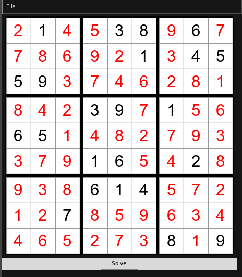

# Sudolver

## Description

This is a sudoku solver coded with Python 3.8.10 with a simple GUI by using tkinter library.

It uses an algorithm which is a combination of backtracking with stohastic search. The solver uses a guess board that contains all the possible numbers(guesses) for a certain cell. Then it elliminates the not possible guesses accrding to the current status of the board and if there is a solution for a cell that is elligible for putting to the board, it's replaced to the board. The same process is repeated until a solution cannot be found(No solution is replaced to the board). Then the status of the board is saved and one elligible guess is replaced to the board. Then the same process is repeated recursively until it reaches a correct solution. If the solution is not correct then the status is reclaimed via backtracking and another guess is replaced to the board. 

The app can save/open boards in csv.

## Screenshot

